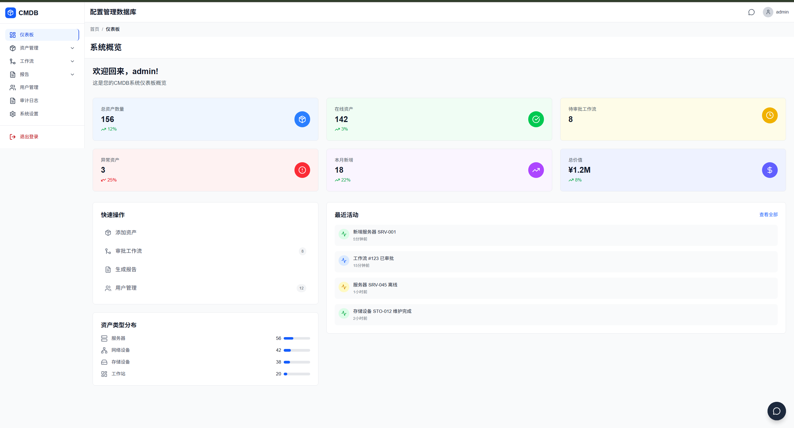

# CMDB - Configuration Management Database

A modern Configuration Management Database system for tracking IT assets and integrating approval workflows, specifically designed for IDC (Internet Data Center) and data center operations.

## Screenshots



*CMDB system dashboard showing asset management, workflows, and monitoring capabilities*

## Features

### Asset Management
- Track all IT assets (servers, network equipment, storage, workstations)
- Monitor asset status (online, offline, maintenance, decommissioned)
- Record asset details including location, description, and cost information
- Bulk asset creation for easy onboarding
- Asset lifecycle management

### Cost Tracking
- Track purchase price and annual costs for each asset
- Visualize cost distribution across asset types
- Monitor total investment and ongoing operational costs
- Currency support for financial tracking

### Workflow Management
- Integrated approval workflows for asset changes
- Status change requests with automated workflow creation
- Maintenance scheduling with approval processes
- Decommissioning workflows for end-of-life assets
- Feishu webhook integration for real approval processes

### Dashboard & Visualization
- Real-time asset status overview
- Interactive charts for asset distribution and workflow status
- Cost visualization with breakdown by asset type
- Critical assets monitoring for key infrastructure components
- Recent activity tracking

### Reporting
- Inventory reports with export to CSV
- Lifecycle reports for asset age tracking
- Compliance reports for audit purposes

## Technology Stack

- **Frontend**: 
  - Traditional implementation: HTML, CSS, JavaScript with Chart.js for data visualization
  - Modern implementation: React with styled-components
- **Backend**: Go with Gin framework
- **Database**: MongoDB for flexible data storage
- **Containerization**: Docker & Docker Compose for easy deployment
- **Service Discovery**: Consul for microservices architecture

## Quick Start

1. **Prerequisites**:
   - Docker and Docker Compose
   - Node.js >= 14.0.0
   - Go (latest stable version)

2. **Installation**:
   ```bash
   # Clone the repository
   git clone <repository-url>
   cd cmdb

   # Install frontend dependencies
   npm install
   ```

3. **Running the Application**:
   ```bash
   # Using Docker Compose (recommended)
   docker-compose up -d

   # Or using start scripts
   ./start.sh        # Linux/Mac
   start.bat         # Windows
   ```

4. **Access the Application**:
   - Frontend: http://localhost:3000
   - Backend API: http://localhost:8081

## Database Initialization

The system automatically initializes the database with realistic sample data on first run, including:
- 16 sample assets across 4 categories (servers, network equipment, storage, workstations)
- 8 sample workflows with various statuses (approved, pending, rejected)
- Proper indexing for optimal query performance

## API Endpoints

### Assets
- `GET /api/v1/assets` - List all assets
- `POST /api/v1/assets` - Create a new asset
- `GET /api/v1/assets/:id` - Get asset by ID
- `PUT /api/v1/assets/:id` - Update asset details
- `DELETE /api/v1/assets/:id` - Request asset decommission
- `GET /api/v1/assets/stats` - Get asset statistics
- `GET /api/v1/assets/types` - Get asset types distribution
- `GET /api/v1/assets/locations` - Get asset locations distribution
- `GET /api/v1/assets/costs` - Get asset cost summary
- `GET /api/v1/assets/critical` - Get critical assets
- `PUT /api/v1/assets/:id/costs` - Update asset costs

### Workflows
- `GET /api/v1/workflows` - List all workflows
- `POST /api/v1/workflows` - Create a new workflow
- `GET /api/v1/workflows/:id` - Get workflow by ID
- `PUT /api/v1/workflows/:id` - Update workflow
- `PUT /api/v1/workflows/:id/approve` - Approve workflow
- `PUT /api/v1/workflows/:id/reject` - Reject workflow
- `GET /api/v1/workflows/stats` - Get workflow statistics

### Reports
- `GET /api/v1/reports/inventory` - Generate inventory report
- `GET /api/v1/reports/lifecycle` - Generate lifecycle report
- `GET /api/v1/reports/compliance` - Generate compliance report

## Frontend Implementations

The project includes two frontend implementations:

1. **Traditional Frontend** ([frontend](file:///c:/Users/HHaou/cmdb/frontend) directory):
   - Plain HTML/CSS/JavaScript implementation
   - Direct API integration
   - Lightweight and fast

2. **React Frontend** ([frontend-react](file:///c:/Users/HHaou/cmdb/frontend-react) directory):
   - Modern React-based implementation
   - Component-based architecture
   - Styled with styled-components
   - Enhanced user experience

Both implementations provide the same functionality and connect to the same backend API.

## Deployment Architecture

The system uses a microservices architecture with the following components:
- MongoDB for data persistence
- Consul for service discovery
- Backend API service
- Frontend web application
- All services containerized with Docker

## Development

To develop and contribute to this project:

1. Backend development:
   ```bash
   cd backend
   go run main.go
   ```

2. Frontend development (traditional):
   ```bash
   npm start
   ```

3. Frontend development (React):
   ```bash
   cd frontend-react
   npm start
   ```